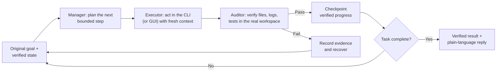

# ai-ceo — LongHorizon-Harness on the Claude Agent SDK

### Loop Engineering for long-horizon agents

**Give the harness a goal once. It keeps working — plan → act → verify →
checkpoint or recover → repeat — until the work is actually done.**

This repository is a 1:1 TypeScript port of
[LongHorizon-Harness](https://github.com/AMAP-ML/LongHorizon-Harness)
(AMAP-ML, arXiv 2608.01964) with the Claude Agent SDK as its execution
backend. The loop, the roles, the file formats, the dashboard, the CLI and the
configuration are the upstream design; only the place that launches an agent
episode changed from `claude --print` to `query()` from
`@anthropic-ai/claude-agent-sdk`.

> The model determines what an agent can do in one round. The harness
> engineers the loop around it: what to do next, how to verify the result in
> the real environment, what progress to preserve, and how to continue after
> failure or context refresh.

## The loop



| Loop responsibility | Role | What it owns |
|---|---|---|
| 🧭 State and next step | **Manager** | Rebuilds each round from the original goal, the stable task contract, verified progress, failure evidence and remaining work; emits exactly one route: `Next: gui / cli / ask / done / blocked` |
| ⚡ Action | **Executor** (GUI or CLI) | Starts with a fresh context and completes one clearly defined step |
| 🔍 Ground truth | **Auditor** (GUI or CLI, read-only) | Independently inspects files, logs and tests; its first three lines are `Status:` / `Integrity:` / `Contract audit:` |
| 💬 Reply | **Final response** | Writes the plain-language answer from the verified state alone |

Only results that pass independent verification become trusted task state. A
rejected result remains evidence, not progress. `Next: done` without a
`complete / clean / aligned` audit is rewritten to `invalid` and fed back as
harness feedback.

## Install

Requirements: Node.js ≥ 22, the `claude` CLI on `PATH` (the SDK spawns it),
and an Anthropic login or `ANTHROPIC_API_KEY` (or a third-party provider key,
see below).

```bash
cd sdk && npm install && npm run build:web      # harness + React workbench
npm link                                         # puts `lh-harness` on PATH (optional)
lh-harness doctor
```

Without `npm link`: `node sdk/bin/lh-harness.mjs <command>`.

## Use

```bash
cd /path/to/your/project
lh-harness init                         # writes ./.lh-harness/config.toml
lh-harness web --workspace-root .       # workbench at http://127.0.0.1:8799/
```

Or from the command line:

```bash
lh-harness run --task @task.md --model claude-opus-5 --max-rounds 20
```

The agents work in the directory you launched from. Every run is stored under
`./.lh-harness/runs/<run-id>/`; the full report, including the final reply,
is `lh_harness/report.json`; the event stream is
`lh_harness/role_orchestration/events.jsonl`; every round's plan, executor
output, audit report and feedback sit in `rounds/round_NNN/`.

Mid-run, from the workbench: answer an approval, send an instruction (claimed by
the very next round), stop, continue, or keep the conversation going after the
run finished — the follow-up continues the same round ledger.

### Configuration

`lh-harness run` reads `./.lh-harness/config.toml`. Precedence: CLI flags >
config.toml > built-in defaults. `[run]` holds `agent`, `model`,
`reasoning_effort`, `max_rounds`, `dashboard`, `prompt_language`, guard
excludes…; `[run.roles.<role>]` overrides agent/model/effort per role along the
chain `gui_executor → executor → [run]`, `cli_auditor → auditor → [run]`,
`final_response → manager`; `[run.timeouts]` sets per-episode seconds
(manager 300, executors 1800, auditor 300). Every field has a CLI flag.

### Any model

The one agent backend is the Claude Agent SDK (`claude_code`). Models are any
Anthropic model id, or `<provider>:<model>` for an OpenAI-compatible /
Anthropic-compatible third-party endpoint declared in
[`sdk/providers.json`](sdk/providers.json) (base URL + the *name* of the env var
holding the key; keys never live in the repo). Pick a different model per role:

```bash
ORCA_API_KEY=... lh-harness run --task @task.md \
  --manager-model claude-opus-5 --executor-model orca:obsidian/Qwen3.8-27B
```

### Docker

`docker/` builds an image that runs the workbench and headless runs isolated
from the host's Claude configuration and network filters — see
[docker/README.md](docker/README.md).

## Repository map

```
sdk/src/               the harness (mirrors upstream src/lh_harness/ module by module)
  manager.ts           the round loop, ledgers, report.json, human gates
  role_prompts.ts      the manager / executor / auditor / final-response prompts, verbatim
  auditor_agent.ts     audit-report parsing, completion guards, workspace-mutation guard
  adapters/            Claude Code adapter on the Agent SDK + role permission policies
  supervisor/          run supervisor, file-based control bus, lifecycle
  dashboard/           state projection and human-gate rules
  webapi/              HTTP + WebSocket control API serving the workbench
  cli.ts               init · run · web · dashboard · doctor · plugin · check-update
sdk/frontend/          the React workbench (core view models + web app)
sdk/tests/             node:test ports of the upstream test-suite
docker/                containerised deployment
```

## Citation

The design, prompts and loop engineering are the work of the LongHorizon-Harness
authors:

```bibtex
@article{longhorizonharness2026,
  title={LongHorizon-Harness: Advancing Long-Horizon Agents for Real-World Tasks},
  author={Ziyu Ma and Hailang Huang and Shun Zou and Yong Wang and Shidong Yang and Yiming Hu and Fei Wei and XiangXiang Chu},
  journal={arXiv preprint arXiv:2608.01964},
  year={2026},
  url={https://arxiv.org/abs/2608.01964}
}
```
